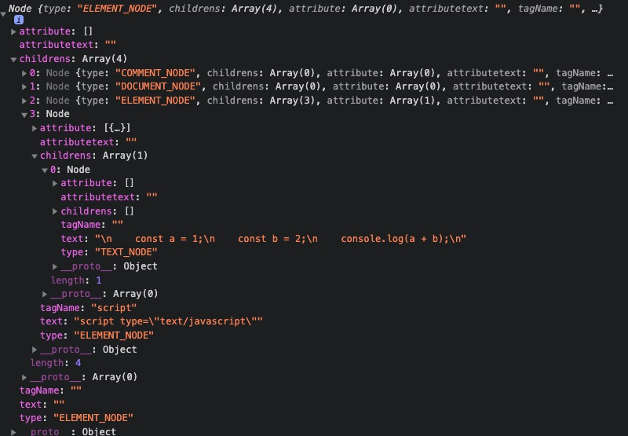

<!--
 * @Author: xiuquanxu
 * @Company: kaochong
 * @Date: 2021-06-18 23:30:45
 * @LastEditors: xiuquanxu
 * @LastEditTime: 2021-07-01 17:21:31
-->
## 前言  
开始之前我们有一些事情需要交代清楚。  
浏览器是一个复杂而又庞大的项目，我们不可能完成一个完完整整的它。我们只是通过非常非常简单的demo来感受一下浏览器是如何简单工作。    

简单到html的话它只能渲染一行一行的div文本，未实现复杂的布局(flex,position等)，只能支持css的color和background-color属性，例如font-size、css3等所有其他属性未支持。只能支持js的document.querySelector的js操作dom的api，其他的操作dom的api都不支持。


## 构建请求  

利用node的http模块和URL模块构建请求  
URL模块根据出入的URL解析出port、host、path等传递个http模块使用。
```
const http = require('http');
const { URL } = require('url');
class Request {
    req(str) {
       const p = new Promise((ok, no) => {
            const { host, pathname, port } = new URL(str);
            const options = {
                port,
                host,
                method: 'GET',
                path: pathname,
            };
            const req = http.request(options, (res) => {
                res.setEncoding("utf-8");
                res.on("data", (chunk) => {
                    ok(chunk)
                });
                req.on("error", (err) => {
                    no(err)
                });
            });
            req.end();
       });
       return p;
    }
}
```

## 构建html-parser  
该parser的作用是把网络模块返回的字符串解析成ast，同时支持一些像\<script src="xxx"\>\</script>这种带有src的要去下载资源然后解析。

解析器的局限性，不会解析\<meta>这种不闭合标签。  

为什么有局限性？实际上写一个非常健壮的html-parser还是挺繁琐的，这不是我们的目的。  

我们解析的标签可以分为：
```
1. 以 <!- 开头的注释
2. 以 <!D 开头的DOCTYPE
3. 以<开头的标签，例如<div></div>
```  
解析流程，我们首先判断是否属于1,2如果是1，2这两种则调用相应的parserComment和parserDocument函数解析生成对应node节点。当遇到<开头但是后面不是!D或者!-这个时候我们可以判断该标签是\<div>\<div>这类的。  
当我们遇到<\/这个标签是时候我们就知道解析该结束了。当其他情况时候就是要生成对应的tagName或者标签中的内容。  
定义Node
```
const NodeType = {
    ELEMENT_NODE: 'ELEMENT_NODE', // <p></p>
    TEXT_NODE: 'TEXT_NODE', // this is text
    COMMENT_NODE: 'COMMENT_NODE', //     <!--  --> html或css注释
    DOCUMENT_NODE: 'DOCUMENT_NODE', // <!DOCTYPE html>
}

class Node {
    constructor(type) {
        this.type = type; // type 为 NodeType类型
        this.childrens = []; // 孩子节点
        this.attribute = []; // 该节点的属性k,v
        this.attributetext = ''; // 该节点的属性文本
        this.tagName = ''; // 该节点的tagName
        this.text = ''; // 该节点的文本
    }
}
```  

定义解析注释和DOCTYPE
```
    function parserDocument() {
        const node = new Node(NodeType.DOCUMENT_NODE);
        let text = '';
        while (i < str.length) {
            text += str[i];
            if (str[i] == '>') {
                i += 1;
                break;
            };
            i += 1;
        }
        node.text = text;
        return node;
    }
    function parserComment() {
        const node = new Node(NodeType.COMMENT_NODE);
        let text = '';
        while(i < str.length) {
            text += str[i];
            if (str[i] == '>') {
                i += 1;
                break;
            }
            i += 1;
        }
        node.text = text;
        return node;
    }
```  

定义解析类似于div这类标签(利用递归解析)
```
    function parserElement() {
        const node = new Node(NodeType.ELEMENT_NODE);
        let text = '';
        while(i < str.length) {
            if (str[i] == '<' && str[i + 1] !== '/' && str[i + 1] !== '!') {
                i += 1;
                node.childrens.push(parserElement());
                continue;
            } else if (str[i] == '<' && getNext(1) == '/') {
                while(1) {
                    i += 1;
                    if (str[i] == '>') {
                        break;
                    }
                }
                i += 1;
                break;
            } else if (str[i] == '<' && getNext(1) == '!' && getNext(2) == '-') {
                node.childrens.push(parserComment());
                continue;
            } else if (str[i] == '<' && getNext(1) == '!' && getNext(2) == 'D') {
                node.childrens.push(parserDocument());
                continue;
            } else if (str[i] == '/' && getNext(1) == '>') {
                i += 2;
                node.text = text;
                break;
            }
            if (str[i] == '>') {
                node.text = text;
                text = '';
                if (str[i + 1] !== '<') {
                    next();
                    node.childrens.push(parserText());
                }
            } else {
                text += str[i];
            }
            i += 1;
        }
        return node;
    }

```

定义解析文本内容:

```
    function parserText() {
        const node = new Node(NodeType.TEXT_NODE);
        let text = '';
        while(i < str.length) {
            if (str[i] == '<') {
                back();
                break;
            }
            text += str[i];
            i += 1;
        }
        node.text = text;
        return node;
    }
```

通过这几个函数的定义我们就可以完成对html的解析，生成对应的node。但是这里还有一个问题，我们还没有解析标签中的属性，就是例如\<div class="black">这样的class属性实际上是以字符串class="black"存在node的attributetext中的，我们需要遍历整棵树来解析对应节点的属性以k，v形式存放在attribute中。  

定义遍历树操作bfs(这里采用广度优先搜索)  

```
function bfs(root, start) {
    if (!root) return;
    const stack = [];
    stack.push(root);
    while(stack.length > 0) {
        for (let i = 0, len = stack.length; i < len; i += 1) {   
            const item = stack.shift();         
            for (let j = 0, lenn = item.childrens.length; j < lenn; j += 1) {
                stack.push(item.childrens[j]);
            }
            start(item);
        }
    }
}
```  
这里挂了一个start的钩子，方便遍历树的时候对节点进行操作


实现解析parserAttribute  

```
 bfs(tree, async (node) => {
            if (node.type == NodeType.ELEMENT_NODE) {
                const text = node.text;
                let i = 0;
                let tagName = '';
                if (!text) return;
                while(i < text.length) {
                    const char = text[i];
                    if (char !== " " && !node.tagName) {
                        tagName += text[i];
                    } else if (char == " " && !node.tagName) {
                        node.tagName = tagName;
                        break;
                    }
                    i += 1;
                }
                if (!node.tagName) {
                    node.tagName = tagName;
                }
                const kvArr = text.match(kvReg);
                if (kvArr && kvArr.length > 0) {
                    kvArr.forEach(item => {
                        let nv = '';
                        const key = item.split("=")[0];
                        const v = item.split("=")[1];

                        for (let i = 0; i < v.length; i += 1) {
                            if (v[i] == "'" || v[i] == '"') {
                                continue;
                            }
                            nv += v[i];
                        }
                        node.attribute.push({
                            k: key,
                            v: nv
                        });
                    });
                }    
            }
        });
```

通过以上操作我们实现了将标签的attribute解析成k，v的形式存放在了node.attribte中。  

但是我们会发现有一些节点例如\<script src="xxx">\</script>这样的节点，我们需要去下载然后在解析，所以我们需要在bfs时候做一下处理  

```
// 下载js
if (node.tagName == 'script') {
    for (let i = 0; i < node.attribute.length; i += 1) {
        const item = node.attribute[i];
        const { k, v } = item;
        if (k == 'src') {
            downloadTask.push({
                url: v,
                node,
            });
        }
    }
}
//  下载css
if (node.tagName == 'link') {
    for (let i = 0; i < node.attribute.length; i += 1) {
        const item = node.attribute[i];
        const { k, v } = item;
        if (k == 'href') {
            downloadTask.push({
                url: v,
                node,
            });
        }
    }
}
```

downloadTask会保存所有下载类的任务，在bfs结束后统一处理。


```
const allTask = [];
for (let i = 0; i < downloadTask.length; i += 1) {
    const { url, node } = downloadTask[i];
    const p = DownloadJsCSS(url, node);
    allTask.push(p);
}
const p = new Promise((ok, no) => {
    Promise.all(allTask).then(() => {
        ok(node);
    }).catch(() => {
        no('error');
    });
});
```

可以看到我们的解析实际上是一个异步过程，因为要等到promise完成后才会resolve。  

至此我们一个html解析流程就完成了。我们可以通过该项目进行测试。  

根据该项目README启动后，查看core/main.js中this.tree = await this.parserHtml();断点打在这里就可以看见生成的tree了。  




## 总结  

- 完成了请求模块构建
- 完成了html-parser模块构建，包括解析、下载js和css以及解析标签的attribute内容。
- <a href="https://github.com/this-spring/mini-browser">github</a>

后面我们将介绍解析css、根据tree和css内容合成renderTree。