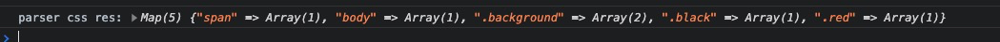
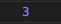
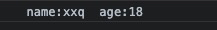
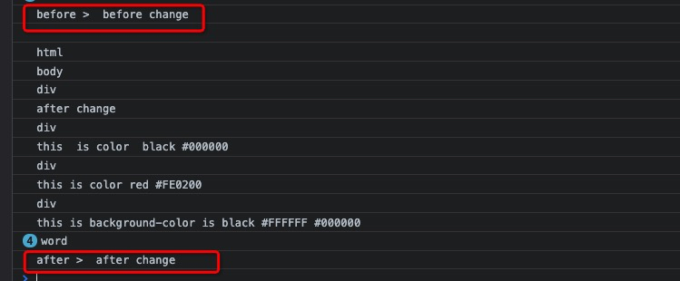

<!--
 * @Author: xiuquanxu
 * @Company: kaochong
 * @Date: 2021-06-18 23:31:04
 * @LastEditors: xiuquanxu
 * @LastEditTime: 2021-07-12 12:55:02
-->

## css解析

在上节中，我们已经把css的文本内容解析成一个一个的node。这节我们只需要遍历树，找到node的tagName是style和link的节点，然后解析对应的文本得到属性的k和v放在一个map中，就可以获得css中属性值。  

```
parserJSCSS() {
    bfs(this.tree, (node) => {
        // 解析js
        if (node.type == NodeType.ELEMENT_NODE && node.tagName == 'script') {
            JsParser(node);
        }
        // 解析css
        if (node.tagName == 'style' || node.tagName == 'link') {
            this.cssMap = CssParser(node);
        }
    });
}

```

CssParser实现  
```
const map = new Map();

function GetCssMap() {
    return map;
}

function CssParser(node) {
    let cssStr = '';
    node.childrens.forEach(item => {
        cssStr += item.text;
    });
    console.log(cssStr);
    let state = 0; // 0默认  1标签开始  2标签中
    let i = 0;
    let key = '';
    let attribute = '';

    function parserAttribute() {
        const attributes = [];
        let token = "";
        while(i < cssStr.length) {
            const char = cssStr[i];
            if (char == " " || char == "{" || char == "\n") {
                i += 1;
                continue;
            };
            if (char == '}') {
                state = 0;
                break;
            } else if (char == ":") {
                attribute = token;
                token = '';
            } else if (char == ";") {
                const obj = new Object();
                obj[attribute] = token;
                token = '';
                attributes.push(obj);
            } else {
                token += char;
            }
            i += 1;
        }
        return attributes;
    }

    while(i < cssStr.length) {
        const char = cssStr[i];
        if (state == 0) {
            if (char == " " || char =="\n") {
                i += 1;
                continue;
            };
            state = 1;
        }
        if (state == 1) {
            if (char == " ") {
                const attributes = parserAttribute();
                map.set(key, attributes);
                key = '';
            } else {
                key += char;
            }
        }
        i += 1;
    }
    return map;
}

module.exports = { CssParser, GetCssMap }
```


## js的runtime  

由于node本身就是一个js的运行时，因此我们直接使用eval函数来运行字符串的js.这部分js包括了html中写script标签获取的，也包含通过script的src属性下载的，他们的文本内容统一作为一个TEXT_NODE存放在他们childrens下面。因此想要获取所有的script内容只要遍历childrens属性下的TEXT_NODE将字符串拼接到一起就可以了。

```
function JsParser(node) {
    let scriptStr = '';
    node.childrens.forEach(item => {
        scriptStr += item.text;
    });
    <!-- 执行js -->
    eval(scriptStr)
}
```  

## js的api实现  

现在可能有一些问题，就是这样运行js时候一些dom的api会报错因为找不到document对象。接下来我们看看js的一些dom的api的实现。  

querySelector该api实现，我们一般使用的时候都是document.querySelector('#id')或者document.querySelector('.class')然后获取一个dom元素。  

我们在实现该api的时候思路就是遍历树，然后找到attribute中包含id是querySelector传入的或者class是querySelector传入的，  

```
querySelector(id) {
    let res = null;
    bfs(this.renderTree, (node) => {
        node.attribute.forEach((item) => {
            if (item.k == 'id' && `#${item.v}` == id) {
                res = node;
            }
        });
    });
    return res;
}
```  

通过遍历tree我们就能找到对应的dom元素。  


innerHTML实现，首先innerHTML是一个属性而不是方法，其次当我们调用innerHTML时候会获取到对应的文本，当我们给他赋值的时候，对应的文本会变成我们赋的值。  

实现思路上，我们给每个Node节点添加一个get和set方法，就叫innerHTML。get方法实现我们获取childrens将文本加在一起。set方法实现，我们创建一个Node节点type属性为TEXT_NODE，然后把它赋值给调用api的那个dom元素的childrens。 
```
set innerHTML(content) {
    const node = new RenderTreeNode();
    node.type = NodeType.TEXT_NODE;
    node.tagName = 'word';
    node.text = content;
    this.childrens = [];
    this.childrens.push(node);
    // 这里要重新render一下因为文本节点有修改
    render();
}

get innerHTML() {
    let str = '';
    this.childrens.forEach((item) => {
        str += item.text;
    });      
    return str;∏
}
``` 

## 效果  

解析server/public/1.css和1.html中的style后生成的css的map  


解析server/public/1.js和1.html中的script后执行js结果 
```
const a = 1;
const b = 2;
console.log(a + b);
```

```
const uname = 'xxq';
const uage = '18';
console.log(` name:${uname}  age:${uage}`);
```


```
setTimeout(() => {
    console.log("before > ", document.querySelector('#test').innerHTML);
    document.querySelector('#test').innerHTML = 'after change';
    console.log("after > ", document.querySelector('#test').innerHTML);
}, 2000);
```
  

## 总结  

- 了解了css的parser过程
- 了解了js的一些dom的api的实现 
- 了解了node环境下js的runtime实现
- <a href="https://github.com/this-spring/mini-browser">github</a>