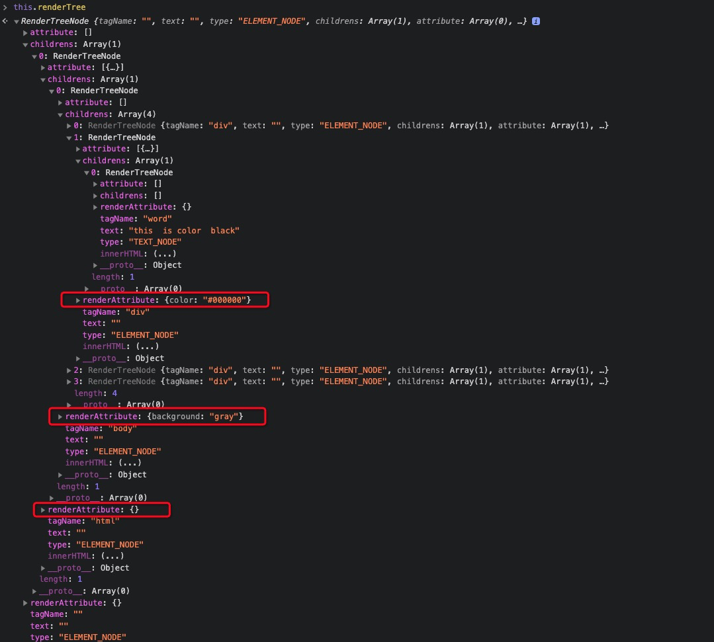
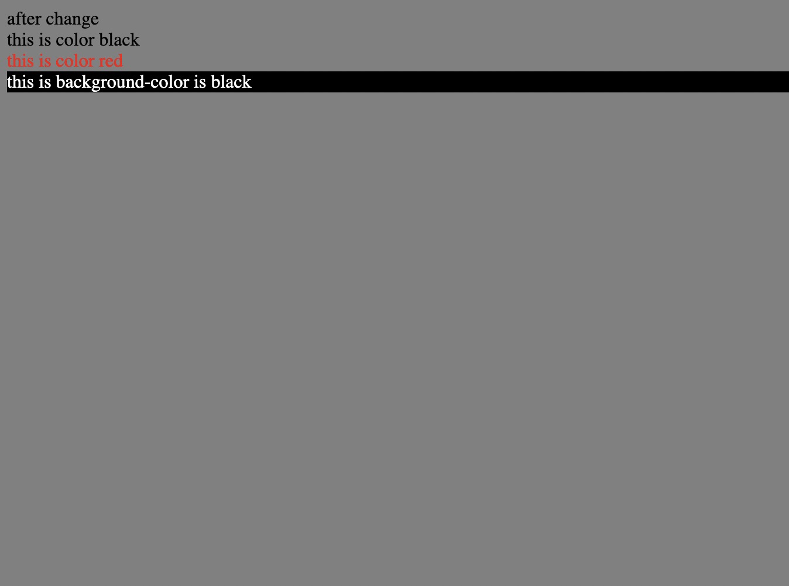
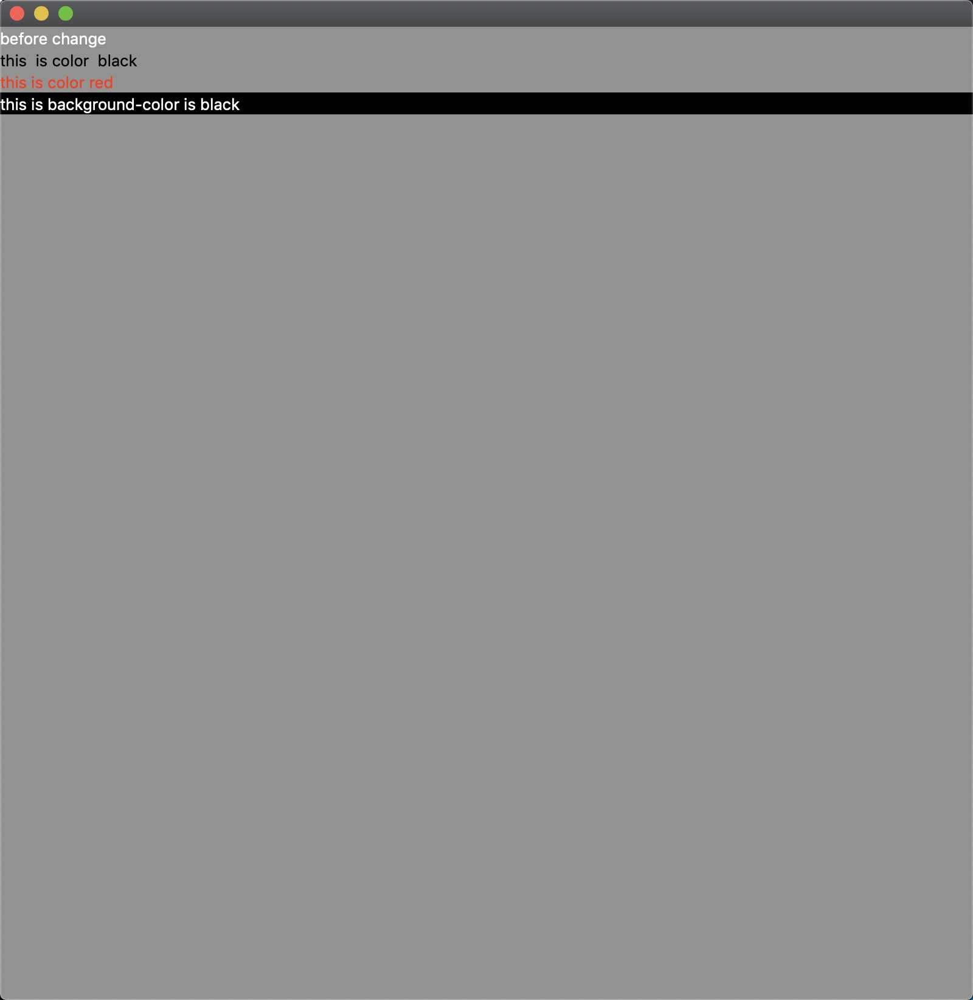
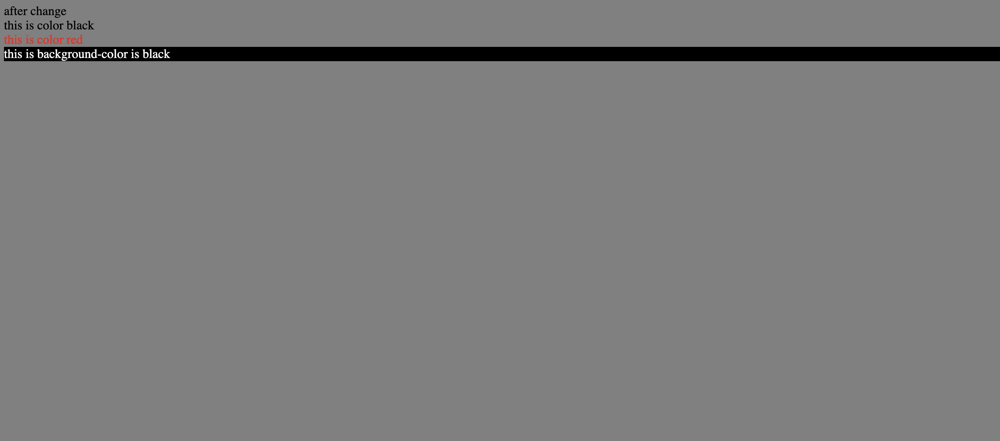

<!--
 * @Author: xiuquanxu
 * @Company: kaochong
 * @Date: 2021-06-24 16:08:44
 * @LastEditors: xiuquanxu
 * @LastEditTime: 2021-07-15 17:40:52
-->
## 合成renderTree
我们之前生成了dom-tree，但是dom-tree不能用于渲染，因为它有很多dom元素例如style、script和link等这样标签不需要真实的渲染，第二点dom-tree没有标明每个dom需要渲染的属性，例如每个dom背景色需要渲染成红色等。

基于以上问题所以我们需要生成一个专门用于渲染的renderTree，它的功能是过滤掉所有不需要渲染的节点，每个dom节点标识出它应该渲染成的样式。  

通过递归方式遍历dom，过滤掉不需要渲染的dom节点  

```
makeRenderTree(root) {
    if (root.tagName == 'style'
        || root.tagName == 'script'
        || root.tagName == 'link' 
        || root.type == NodeType.DOCUMENT_NODE 
        || root.type == NodeType.COMMENT_NODE
        || (root.type == NodeType.TEXT_NODE && root.text.trim() == '')) return null;
    const node = new RenderTreeNode();
    if (root.type == NodeType.TEXT_NODE) {
        root.tagName = 'word';
        node.text = root.text;
    }
    node.tagName = root.tagName;
    node.type = root.type;
    node.attribute = root.attribute;
    for (let i = 0; i < root.childrens.length; i += 1) {
        const rtNode = this.makeRenderTree(root.childrens[i]);
        rtNode && node.childrens.push(rtNode);
    }
    if (node.type == NodeType.ELEMENT_NODE && node.childrens.length == 0) return null;
    return node;
}
```

遍历生成的renderTree的每个节点并为每个节点根据id、class和标签为标识，从生成的cssMap中找到对应的css对应的样式，并赋值给renderTree的renderAttribute这个属性。
```
cssToRenderTree() {
    bfs(this.renderTree, (node) => {
        const renderAttribute = node.renderAttribute;
        const ele = node.tagName;
        let classs = '';
        let id = '';
        for (let i = 0; i < node.attribute.length; i += 1) {
            if (node.attribute[i].k == 'class') {
                classs = node.attribute[i].v;
            }
            if (node.attribute[i].k == 'id') {
                id = node.attribute[i].v;
            }
        }
        this.cssMap.get(ele) && this.cssMap.get(ele).forEach((kv) => {
            Object.assign(renderAttribute, renderAttribute, kv);
        });
        this.cssMap.get(`.${classs}`) && this.cssMap.get(`.${classs}`).forEach((kv) => {
            Object.assign(renderAttribute, renderAttribute, kv);
        });
        this.cssMap.get(`#${id}`) && this.cssMap.get(`#${id}`).forEach((kv) => {
            Object.assign(renderAttribute, renderAttribute, kv);
        });
        node.renderAttribute = renderAttribute;
    });
}
```

到此我们就生成了一个renderTree，它过滤了不需要渲染的标签以及为每个标签标识css属性（存储在每个节点的renderAttribute中）。  



## 利用yue-gui渲染html  

生成renderTree以后就要根据renderTree对应的dom以及css属性渲染到一个gui框架上（之前想用opengl来实现，但是实现过程中遇到了点问题，所以先用node的yue-gui来实现ui渲染）。  

<a href="https://libyue.com/">https://libyue.com/</a>  

具体yue-gui的使用我们就不讲了，这里只涉及简单的流程都会有注释。  

创建窗口、设置窗口大小以及设置窗口背景色  

```
const gui = require('gui');
const width = 800;
const height = 800;
const win = gui.Window.create({})
win.setContentSize({width: width, height: height})
win.setBackgroundColor("#808080");
```


利用gui写一个方法，该方法实现组件创建，内容和css属性
```
function makeDiv(text, color, bgcolor) {
  let label = gui.Label.create(text);
  color && label.setStyle({
    color: color
  });
  bgcolor && label.setBackgroundColor(bgcolor);
  label.setAlign("start");
  return label;
}
```  

遍历dom树，查找对应的text和css属性利用gui渲染
```
function render() {
  contentView.removeChildView(contentView2);
  contentView2 = gui.Container.create();
  bfs(b.renderTree, (node) => {
    console.log(node.tagName);
    let color = '';
    let bgcolor = '';
    // TEXT_NODE
    if (node.type == 'ELEMENT_NODE') {
      // 获取颜色属性
      if (node.renderAttribute.color) {
        color = node.renderAttribute.color;
      }
      if (node.renderAttribute['background-color']) {
        bgcolor = node.renderAttribute['background-color'];
      }
      // 要渲染的文字
      let str = '';
      for (let i = 0; i < node.childrens.length; i += 1) {
        const item = node.childrens[i];
        if (item.type == 'TEXT_NODE') {
          str += item.text;
        }
      }
      if (!str) return;
      console.log(str, color, bgcolor);
      contentView2.addChildView(makeDiv(str, color, bgcolor));
    }
    contentView.addChildView(contentView2);
  });
}
```

完整gui渲染代码：

```
onst gui = require('gui');
const { b, bfs } = require('../main.js');
const width = 800;
const height = 800;
const win = gui.Window.create({})
win.setContentSize({width: width, height: height})
win.setBackgroundColor("#808080");
win.onClose = () => gui.MessageLoop.quit()

// 创建label
const contentView = gui.Container.create()
let contentView2 = gui.Container.create()
function makeDiv(text, color, bgcolor) {
  let label = gui.Label.create(text);
  color && label.setStyle({
    color: color
  });
  bgcolor && label.setBackgroundColor(bgcolor);
  label.setAlign("start");
  return label;
}


function render() {
  contentView.removeChildView(contentView2);
  contentView2 = gui.Container.create();
  bfs(b.renderTree, (node) => {
    console.log(node.tagName);
    let color = '';
    let bgcolor = '';
    // TEXT_NODE
    if (node.type == 'ELEMENT_NODE') {
      // 获取颜色属性
      if (node.renderAttribute.color) {
        color = node.renderAttribute.color;
      }
      if (node.renderAttribute['background-color']) {
        bgcolor = node.renderAttribute['background-color'];
      }
      // 要渲染的文字
      let str = '';
      for (let i = 0; i < node.childrens.length; i += 1) {
        const item = node.childrens[i];
        if (item.type == 'TEXT_NODE') {
          str += item.text;
        }
      }
      if (!str) return;
      console.log(str, color, bgcolor);
      contentView2.addChildView(makeDiv(str, color, bgcolor));
    }
    contentView.addChildView(contentView2);
  });
}
globalThis.render = render;

contentView.addChildView(contentView2);
win.setContentView(contentView);
win.activate();


// Browser部分
(async () => {
  await b.run();
  render();
  if (!process.versions.yode) {
    gui.MessageLoop.run()
    process.exit(0)
  }
})();

```  

## mini-browser效果演示

最后的效果演示：  

该html在web端渲染结果：  
  

在mini-browser渲染结果  
js执行之前  
  

js执行之后  
  

## 总结  
 - 到此我们完成了一个浏览器非常*n的渲染过程
 - 后面系列文章会继续深入探索